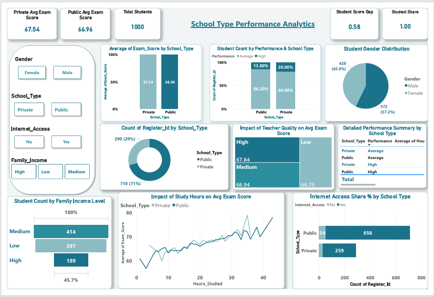

<h1 align="center">🎓 School Type Performance Analytics Dashboard</h1>

<h3 align="center">
Interactive Student Performance Analysis Using Python & Power BI
</h3>

 

 

<h2>📌 Project Overview</h2>

This project focuses on analyzing student academic performance based on school type to understand how educational and personal factors influence exam scores.

Using Python and Power BI, the student dataset was cleaned, transformed, analyzed, and visualized to create an interactive dashboard that provides insights into study habits, attendance patterns, teacher quality, internet accessibility, and family income impact on academic performance.

The dashboard helps compare Public and Private school performance and supports data-driven educational decision-making.

 

<h2>🎯 Project Objectives</h2>

✅ Compare academic performance between Public and Private schools

✅ Analyze the relationship between study hours and exam scores

✅ Evaluate the impact of teacher quality on student performance

✅ Understand how internet access affects learning outcomes

✅ Analyze attendance patterns and student engagement

✅ Identify performance gaps and educational improvement opportunities

 

<h2>📂 Dataset Information</h2>

<table>
<tr>
<th>Category</th>
<th>Details</th>
</tr>

<tr>
<td>📌 Dataset</td>
<td>Student Performance Factors Dataset</td>
</tr>

<tr>
<td>🏫 Domain</td>
<td>Education Analytics</td>
</tr>

<tr>
<td>🛠️ Tools Used</td>
<td>Python, Power BI</td>
</tr>

<tr>
<td>📊 Analysis Type</td>
<td>Student Performance Analytics</td>
</tr>

</table>

 

<h2>🔄 Data Cleaning & Preprocessing</h2>

<h3>🧹 Data Cleaning Using Python</h3>

- Removed duplicate records  
- Handled missing values  
- Standardized categorical values  
- Verified numerical columns  
- Corrected inconsistent data entries  

<h3>⚙️ Feature Engineering</h3>

<h4>🔄 Created Derived Columns</h4>

- Attendance_Status  
- Improved_Performance  
- Performance_Category  
- Score_Improvement_Percentage  
- Study_Efficiency  

<h3>🧩 Data Modeling</h3>

- Built optimized Power BI data model  
- Improved dashboard performance and reporting efficiency  

 

<h2>📊 Dashboard KPI Metrics</h2>

- Total Students  
- Average Exam Score  
- Student Share by School Type  
- Student Performance Gap  
- Average Study Hours  
- Internet Access Percentage  

 

<h2>📈 Python Visualizations Used</h2>

- Histogram Plot – Distribution of Exam Scores  
- Scatter Plot – Attendance vs Exam Score  
- Count Plot – Gender Distribution  
- Pivot Table – Average Exam Score by School Type and Gender  
- Correlation Heatmap  
- Violin Plot – School Type vs Exam Score  
- Pairplot – Academic Performance Analysis  
- Box Plot – School Type vs Attendance  
- KDE Plot – Study Hours Density by School Type  
- Bubble Scatter Plot – Study Hours vs Exam Score by School Type  

 

<h2>📊 Power BI Dashboard Visualizations</h2>

<h3>📌 KPI Cards</h3>

- Total Students  
- Average Exam Score  
- Student Share  
- Performance Gap  

<h3>📈 Dashboard Charts</h3>

- Average Exam Score by School Type  
- Student Count by School Type  
- Study Hours vs Exam Score  
- Teacher Quality Impact  
- Internet Access Analysis  
- Family Income Distribution  
- Gender Distribution  
- Public vs Private School Comparison  
- Student Performance Distribution  

 

<h2>📉 Key Insights</h2>

🎓 Private school students achieved slightly higher average exam scores compared to public school students.

🏫 Public schools managed the majority of students while maintaining performance levels close to private schools.

📚 Students with higher study hours generally achieved better academic performance.

🌐 Internet access positively influenced learning engagement and exam scores.

👨‍🏫 Students taught by high-quality teachers achieved improved academic outcomes.

💰 Most students belonged to medium-income families, influencing access to educational resources and learning support.

📈 A large number of students were categorized under average performance, highlighting opportunities for academic improvement programs.

 

<h2>📖 Dashboard Storytelling</h2>

The dashboard highlights that school type alone does not completely determine student success.

Although private schools showed slightly better academic performance, public schools handled a significantly larger student population while maintaining competitive results. The analysis revealed that factors such as study habits, attendance consistency, internet accessibility, teacher quality, and educational support systems play a major role in improving student outcomes.

This project helps educational institutions identify performance gaps, understand student learning behavior, and implement data-driven strategies to improve academic success across different school sectors.

 

## 📊 Dashboard Preview

<h2>🧠 Conclusion</h2>

This School Type Performance Analytics project demonstrates a complete end-to-end data analytics workflow using Python and Power BI.

Using Python, the raw student dataset was cleaned, transformed, and analyzed through feature engineering and exploratory data analysis techniques. Multiple visualizations and analytical graphs were created to identify trends related to study behavior, attendance patterns, teacher quality, internet accessibility, and academic performance.

The processed dataset was integrated into Power BI to develop an interactive dashboard for performance monitoring and comparative analysis. The dashboard revealed that while private schools achieved slightly higher average exam scores, public schools maintained competitive academic performance while handling a larger student population.

The analysis also highlighted that study hours, attendance, internet access, and teacher quality have a stronger influence on student success than school type alone. Overall, this project supports data-driven educational decision-making and helps institutions identify opportunities to improve student learning outcomes and academic performance.

 

<h2>👩‍💻 Author</h2>

<h3>Preethi P</h3>

Data Analyst

🌐 GitHub Repository:  
<a href="https://github.com/preethi2013">School Type Performance Analytics Dashboard</a>

 

<h2>📚 Tags</h2>

#PowerBI #EducationAnalytics #StudentPerformance  
#Python #Dashboard #DataVisualization  
#BusinessAnalytics #DataAnalytics
